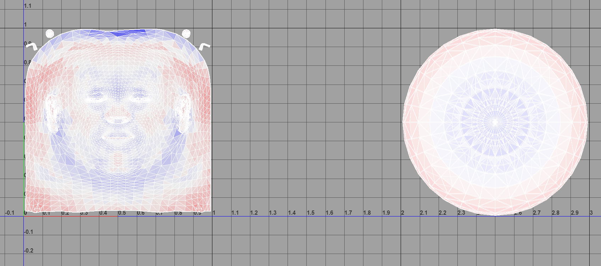
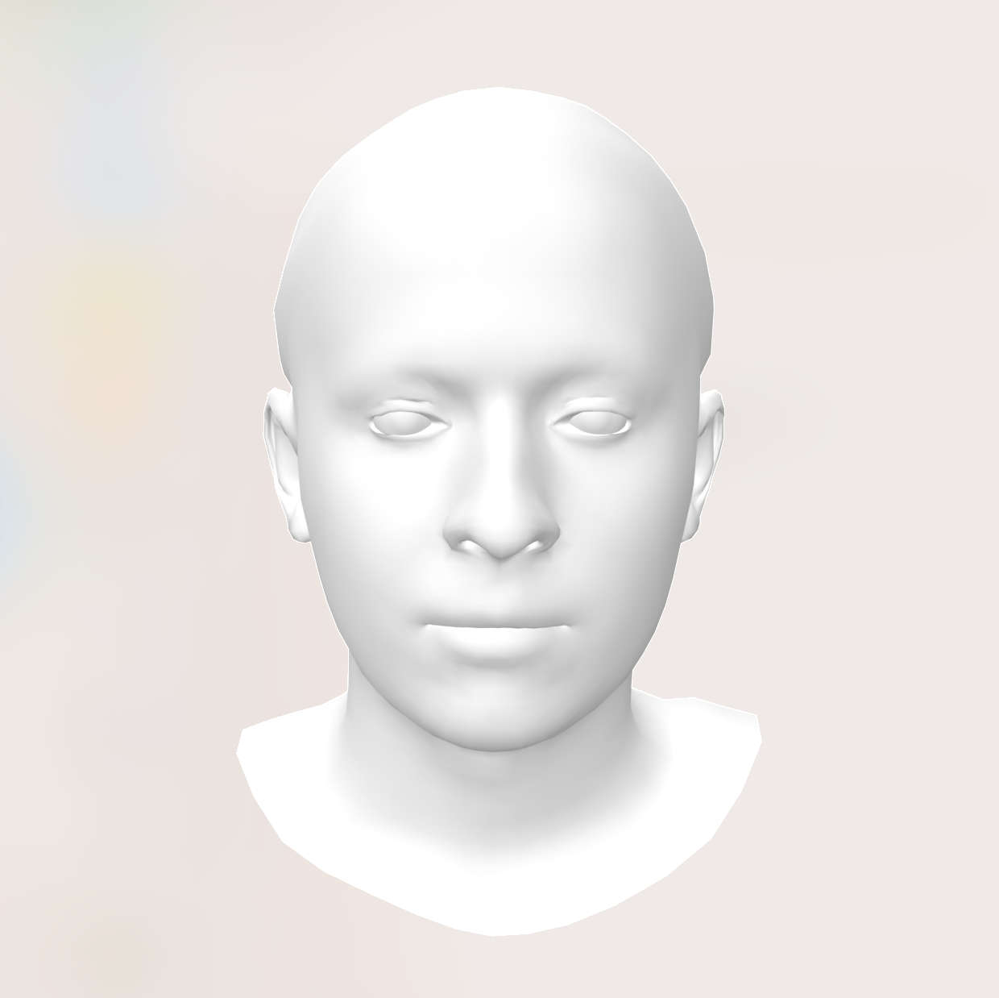
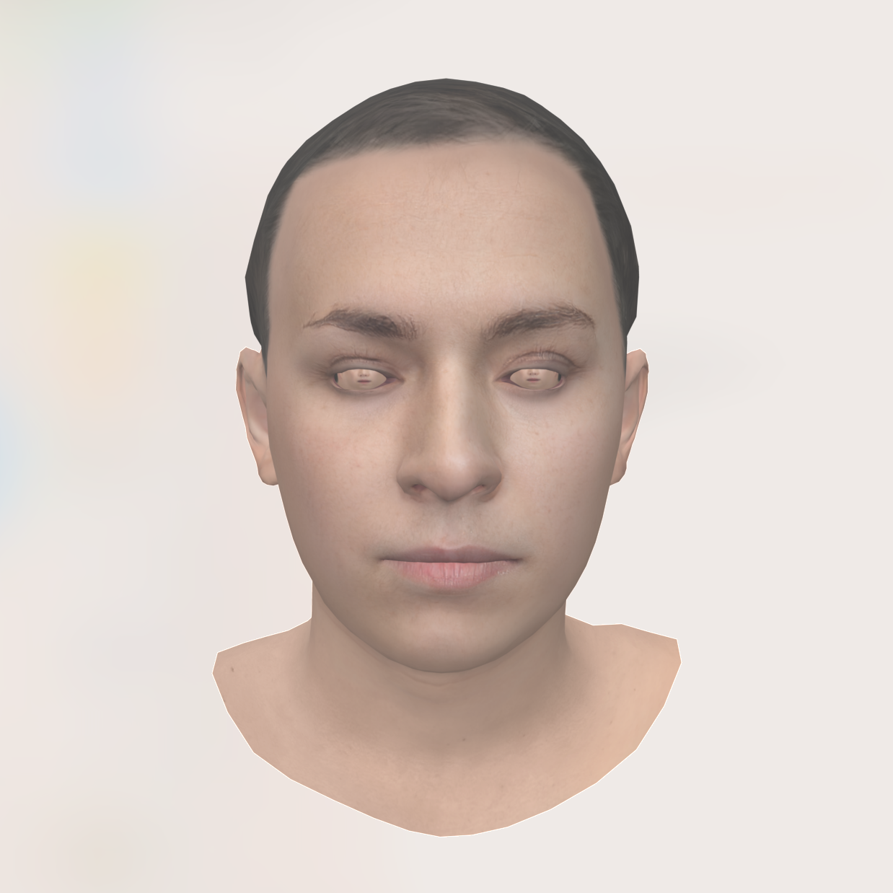
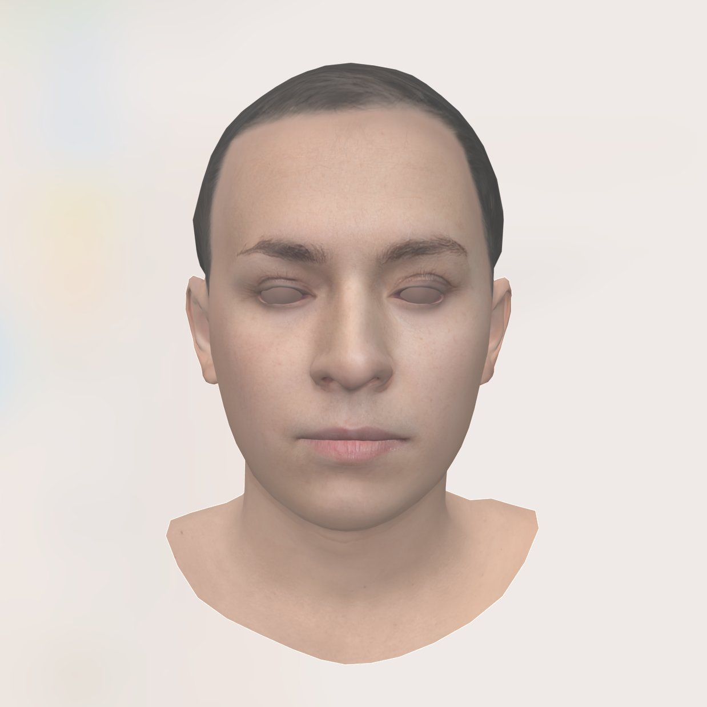

# Using our UV-texture maps on a FLAME mesh


## Details of the solution for using our UV-texture maps on a FLAME mesh


#### Align the topology
- We align the vertices of the [FLAME](https://flame.is.tue.mpg.de/) topology with the UV coordinates of our UV-texture map ([HiFi3D++](https://github.com/czh-98/REALY) topology).
- And the UV coordinates of our UV-texture map corresponding to the FALME vertices/faces are saved in [[FLAME_w_HIFI3D_UV.obj]](./FLAME_Apply_HIFI3D_UV/flame2hifi3d_assets/FLAME_w_HIFI3D_UV.obj).
- Using these UV coordinates, the FLAME meshes can look for texture colors from the UV-maps in the FFHQ-UV dataset.

#### Copy the UV coordinates to a FLAME mesh
- Prepare a head mesh with FLAME topology, and an UV-texture map with HiFi3D++ topology.
- Put the head mesh and the UV-texture map into one folder.
- Modify the configuration and then run the following script to process the head mesh.
- The output FLAME mesh is able to use HiFi3D++ UV-texture map.
```
sh run_flame_apply_hifi3d_uv.sh  # Please refer to this script for detailed configuration
```

#### The issue of eyeballs
- [FLAME](https://flame.is.tue.mpg.de/) mesh contains eyeball vertices, but our UV-texture map does not contain eyeball textures.
- The indices of eyeball vertices in [FLAME](https://flame.is.tue.mpg.de/) mesh are 3931 ~ 5022 (indexed from 0).
- One can let the eyeball vertices look for textures from another eyeball texture map when rendering.
- We also provide an additional eyeball texture map [[eye_ball_tex.png]](./FLAME_Apply_HIFI3D_UV/flame2hifi3d_assets/eye_ball_tex.png)

#### The range of UV coordinates
- The range of UV coordinates for the facial area is (0-1, 0-1).
- The range of UV coordinates for the eyeball area is (2-3, 0-1).



#### Visualization
- A FLAME head mesh.



- An UV-texture map from our FFHQ-UV dataset.


- The processed head mesh which is copied the UV coordinates. It can apply our UV-texture map.
- You will find that the eyeball vertices directly use the facial textures.
- This is because two UV-texture maps cannot be specified in one .obj file, so the eyeball vertices directly reuses the given facial UV-texture map.
- **One should let the eyeball vertices look for textures from another eyeball texture map when rendering.**



- Simply setting the UV coordinates of the eyeball vertices to (1.0, 1.0) can temporarily masks the eyeball texture.
- This is only for simple visualization and is not recommended for rendering.




## Acknowledgments
The aligned UV coordinates were generously provided by **Han Liu** from Tencent AI Lab. Thanks for his invaluable contribution.
